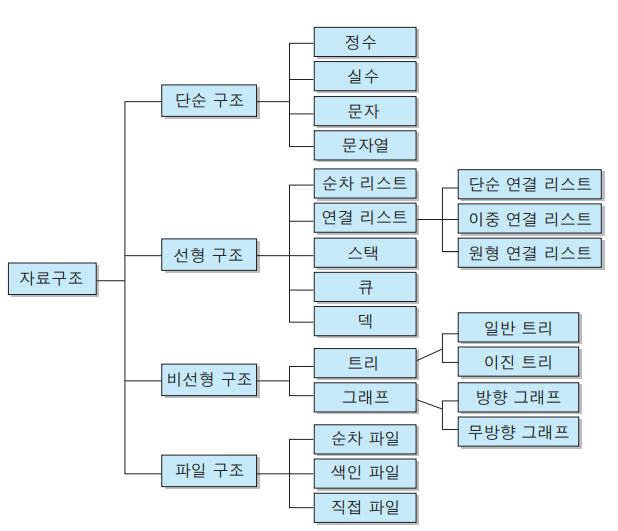

# :sparkles:**STUDY ALGORITHMS**:sparkles:

#### [Algorithms 표준코드 및 이론정리](https://github.com/tesschung/TIL-garden/tree/master/Algorithms)

GOAL! 
PRO

파일명:
문제번호_문제제목_알고리즘.py
문제번호.txt

git commit -m:
문제번호_알고리즘

---

Directory:

- :mortar_board: 
<a style="color:black" href="https://swexpertacademy.com/main/main.do">[SWexpertacademy]</a> (삼성소프트웨어아카데미 문제)
    - temp
    - D2
    - D3
    - D4
    - D5
    - D6
    - Courses(related to the learning categories)
    - 제출
  
- <a style="color:black" href="https://www.acmicpc.net/">[Baekjoon]</a> (백준 문제)
    - 백준
    
- <a style="color:black" href="http://jungol.co.kr/">[Jungol]</a> (정올 문제)
    - 정올

- Pre_Exam (기업별 기출 문제)
    - Samsung 
      문제등급_제목_알고리즘  
    - 카카오
    - Line&Naver
    

---

공부순서

1. 2-30분 문제 분석
2. 알고리즘 구상 불가시 코드 분석 및 이해
3. 스스로 재코딩
4. 풀었던 문제 다시 풀기

---

<a style="color: black" href="https://programmers.co.kr/learn/challenges">[프로그래머스]</a>

- 코딩테스트연습

<a style="color: black" href="https://swexpertacademy.com/main/main.do">
[삼성소프트웨어아카데미]</a>

- 삼성 기출
- Difficulty 1-Attack
- Lectures

<a style="color: black" href="https://www.acmicpc.net/">[백준]</a>
- 삼성 기출
- 카카오 기출

---

<a style="color: black" href="https://wayhome25.github.io/cs/2017/04/17/cs-18/" >[초보몽키]</a>

단순구조 : 프로그래밍에서 사용되는 기본 데이터 타입

선형구조 : 저장되는 자료의 전후관계가 1:1 (리스트, 스택, 큐 등)

비선형구조 : 데이터 항목 사이의 관계가 1:n 또는 n:m (트리, 그래프 등)

파일구조 : 서로 관련된 필드들로 구성된 레코드의 집합인 파일에 대한 자료구조

<a style="color: black" href="https://librewiki.net/wiki/%EC%8B%9C%EB%A6%AC%EC%A6%88:%EC%88%98%ED%95%99%EC%9D%B8%EB%93%AF_%EA%B3%BC%ED%95%99%EC%95%84%EB%8B%8C_%EA%B3%B5%ED%95%99%EA%B0%99%EC%9D%80_%EC%BB%B4%ED%93%A8%ED%84%B0%EA%B3%BC%ED%95%99/%EC%95%8C%EA%B3%A0%EB%A6%AC%EC%A6%98_%EA%B8%B0%EC%B4%88#.EC.9E.90.EB.A3.8C.EA.B5.AC.EC.A1.B0">[자세한내용]</a>

[알고리즘 공부방법 박트리](https://baactree.tistory.com/14)

[이산수학 칸아카데미](https://ko.khanacademy.org/math/linear-algebra/vectors-and-spaces/vectors/v/adding-vectors)

[알고리즘 칸아카데미](https://ko.khanacademy.org/computing/computer-science/algorithms#merge-sort)

---
DP - 1463, 11726, 11727, 9095, 10844, 11057, 2193, 9465, 2156, 11053, 11055, 11722, 11054, 1912, 2579, 1699, 2133, 9461, 2225, 2011, 11052, 2751, 11650, 11651, 10814, 10825, 10989, 11652, 11004, 10828, 9012, 10799, 10845, 10866, 10808, 10809, 10820, 2743, 11655, 10824, 11656, 1406, 1158, 1168, 10430, 2609, 1934, 1850, 9613, 11005, 2745, 1373, 1212, 2089, 11576, 1978, 1929, 6588, 11653, 10872, 1676, 2004

그래프 - ~~1260~~, ~~11724~~, ~~1707~~, ~~10451~~, 2331, 9466, 2667, ~~4963~~, ~~7576~~, ~~2178~~, ~~2146~~, ~~1991~~, ~~11725~~, ~~1167~~, 1967

다익스트라 - ~~1753~~, ~~1916~~

플로이드워셜 - ~~1238~~

분할정복 - 11728, 1780, 11729, 1992, 2447, 2448, 1517, 2261

그리디 - 11047, 2875, 10610, 1783, 1931, 11399, 2873, 1744

완전탐색 - ~~1476~~, 1107, 1451, 9095, 10819, 10971, 1697, 1963, 9019, 1525, 2251, 2186, 3108, 5014, 1759, 2580, 1987, 6603, 1182, 2003, 1806, 1644, 1261, 1208, 7453, 2632, 2143

### 시뮬레이션

- [나무 재테크](https://www.acmicpc.net/problem/16235)
- [2×2×2 큐브](https://www.acmicpc.net/problem/16939)
- [큐빙](https://www.acmicpc.net/problem/5373)
- [봄버맨](https://www.acmicpc.net/problem/16918)
- 주사위 굴리기
- 톱니바퀴
- :heavy_check_mark:톱니바퀴 (2)
- :heavy_check_mark:로봇 청소기
- :heavy_check_mark: 경사로
- 뱀
- 드래곤 커브
- 미네랄
- iSharp
- LCD Test

### 브루트 포스

- :heavy_check_mark: [파이프 옮기기 1](https://www.acmicpc.net/problem/17070)
- [Maaaaaaaaaze](https://www.acmicpc.net/problem/16985)
- [인싸들의 가위바위보](https://www.acmicpc.net/problem/16986)
- [계란으로 계란치기](https://www.acmicpc.net/problem/16987)
- [Baaaaaaaaaduk2 (Easy)](https://www.acmicpc.net/problem/16988)
- [괄호 추가하기](https://www.acmicpc.net/problem/16637)
- [괄호 추가하기 2](https://www.acmicpc.net/problem/16638)
- [로마 숫자 만들기](https://www.acmicpc.net/problem/16922)
- [문자열 추측](https://www.acmicpc.net/problem/16925)
- [두 스티커](https://www.acmicpc.net/problem/16937)
- [캠프 준비](https://www.acmicpc.net/problem/16938)
- [숫자 재배치](https://www.acmicpc.net/problem/16943)
- [매직 스퀘어로 변경하기](https://www.acmicpc.net/problem/16945)
- [A → B](https://www.acmicpc.net/problem/16953)
- [텔레포트](https://www.acmicpc.net/problem/16958)
- [블록 놀이](https://www.acmicpc.net/problem/16951)
- [차량 번호판 1](https://www.acmicpc.net/problem/16968)
- [십자가 2개 놓기](https://www.acmicpc.net/problem/17085)
- [등차수열 변환](https://www.acmicpc.net/problem/17088)
- :heavy_check_mark:[캐슬 디펜스](https://www.acmicpc.net/problem/17135)
- :heavy_check_mark: [색종이 붙이기](https://www.acmicpc.net/problem/17136)
- :heavy_check_mark: 테트로미노
- 링크와 스타트
- :heavy_check_mark: 연구소1
- :heavy_check_mark: 연구소2
- :heavy_check_mark: 연구소3
- :heavy_check_mark: 감시
- 사다리 조작
- :heavy_check_mark: 치킨 배달
- 숫자판 점프
- 테트리스
- 삼각형의 값
- 자와 각도기
- 한윤정이 이탈리아에 가서 아이스크림을 사먹는데
- 부분수열의 합
- 두 동전
- 에너지 모으기

### BFS

- [뱀과 사다리 게임](https://www.acmicpc.net/problem/16928)
- [데스 나이트](https://www.acmicpc.net/problem/16948)
- :heavy_check_mark:[인구 이동](https://www.acmicpc.net/problem/16234)
- [아기 상어](https://www.acmicpc.net/problem/16236)
- [숨바꼭질 5](https://www.acmicpc.net/problem/17071)
- [확장 게임](https://www.acmicpc.net/problem/16920)
- [벽 부수고 이동하기 4](https://www.acmicpc.net/problem/16946)
- [모양 만들기](https://www.acmicpc.net/problem/16932)
- [서울 지하철 2호선](https://www.acmicpc.net/problem/16947)
- [체스판 여행 1](https://www.acmicpc.net/problem/16959)
- [움직이는 미로 탈출](https://www.acmicpc.net/problem/16954)
- :heavy_check_mark:[직사각형 탈출](https://www.acmicpc.net/problem/16973)
- 구슬 탈출 4
- 과외맨
- 양
- 스타트링크
- 돌 그룹
- 벽 부수고 이동하기 2
- 말이 되고픈 원숭이
- 적록색약
- :heavy_check_mark:성곽
- 백조의 호수
- 새로운 하노이 탑
- 4 연산
- 거울 설치
- 견우와 직녀

### 다이나믹 프로그래밍

- :heavy_check_mark: 퇴사 
- :heavy_check_mark: 퇴사 2
- 알약
- ABC
- 출근 기록
- 뮤탈리스크
- Acka
- 플레이리스트
- N-Rook II
- 사다리 게임

### 기타

- [배열 돌리기 1](https://www.acmicpc.net/problem/16926)
- [배열 돌리기 3](https://www.acmicpc.net/problem/16935)
- :heavy_check_mark:배열 돌리기 4​
- [양념 반 후라이드 반](https://www.acmicpc.net/problem/16917)
- [나3곱2](https://www.acmicpc.net/problem/16936)
- [십자가 찾기](https://www.acmicpc.net/problem/16924)
- [겉넓이 구하기](https://www.acmicpc.net/problem/16931)
- [늑대와 양](https://www.acmicpc.net/problem/16956)
- [배열 복원하기](https://www.acmicpc.net/problem/16967)
- [Two Dots](https://www.acmicpc.net/problem/16929)
- [BFS 스페셜 저지](https://www.acmicpc.net/problem/16940)
- [DFS 스페셜 저지](https://www.acmicpc.net/problem/16964)
- [체스판 위의 공](https://www.acmicpc.net/problem/16957)
- [미로 탈출하기](https://www.acmicpc.net/problem/17090)
- [배열 B의 값](https://www.acmicpc.net/problem/16971)
- [레벨 햄버거](https://www.acmicpc.net/problem/16974)
- [파이프 옮기기 2](https://www.acmicpc.net/problem/17069)
- NxM 보드 완주하기
- 수족관 1
- 스도미노쿠
- 욕심쟁이 판다
- 사탕 게임
- 로봇 조종하기
- 가장 큰 정사각형
- 시험 감독
- AB
- 곱셈
- 이항 계수 2
- 구간 합 구하기 4
- 나머지 합
- 책 페이지
- 무한 문자열
- A와 B

---

## 1008-1020 STUDY! GRIT! D-12

평균1시간30분씩 걸리는 문제들입니다! 하루 3개 이상 푸는거 목표!
삼성 기출/유명한 문제로 골랐습니다.

  :star: : 삼성 A형 기출 문제

  :heavy_check_mark: : 풀었던 문제

  :cherry_blossom: : 좋아 보이는 문제

  ## Queue

  - 10845: 큐 :heavy_check_mark: 
  - 2164: 카드2
  - 1966: 프린터 큐 :cherry_blossom::heavy_check_mark:
  - 3078: 좋은 친구
  - 10866: 덱
  - 5430: AC

  

  ## Stack

  - 10828: 스택
  - 1725: 히스토그램 :cherry_blossom:
  - 2304: 창고 다각형
  - 2841: 외계인의 기타 연주
  - 3986: 좋은 단어
  - 5076: Web Pages
  - 16637: 괄호 추가하기 :star:
  - 17070: 파이프 옮기기1 :star::heavy_check_mark:

  ## Graph

  - 1991: 트리 순회 :cherry_blossom::heavy_check_mark:

  - 11725: 트리의 부모 찾기 :cherry_blossom::heavy_check_mark:

  - 1167: 트리의 지름 :cherry_blossom::heavy_check_mark:

  - 1967: 트리의 지름 :cherry_blossom::heavy_check_mark:

    

  ## DFS & BFS

  - 17136: 색종이 붙이기 :star::heavy_check_mark:
  - 3019: 테트리스 :cherry_blossom:
  - 2234: 성곽 :cherry_blossom:
  - 12906: 새로운 하노이 탑
  - 14395: 4연산
  - 2151: 거울 설치 :cherry_blossom:
  - 16932: 모양 만들기 :cherry_blossom:
  - 16947: 서울 지하철 2호선 :cherry_blossom:
  - 16959: 체스판 여행1 :cherry_blossom:
  - 16928: 뱀과 사다리 게임
  - 16948: 데스 나이트
  - 16234: 인구이동 :heavy_check_mark:
  - 16236: 아기 상어 뚜루루뚜루 :cherry_blossom:
  - 16920: 확장 게임
  - 16954: 움직이는 미로 탈출
  - 16973: 직사각형 탈출 :heavy_check_mark:
  - 1600: 말이 되고픈 원숭이 :cherry_blossom:
  - 3197: 백조의 호수
  - 16137: 견우와 직녀
  - 2644: 촌수계산
  - 2178: 미로 탐색
  - 6593: 상범 빌딩
  - 5427: 불
  - 3055: 탈출
  - 2206: 벽 부수고 이동하기 :heavy_check_mark:
  - 7576: 토마토 :cherry_blossom::heavy_check_mark:
  - 7562: 나이트의 이동
  - 5014: 스타트링크
  - 1697: 숨바꼭질 :cherry_blossom:
  - 16397: 탈출
  - 9019: DSLR 
  - 1525: 퍼즐
  - 1039: 교환
  - 11724: 연결 요소의 개수 :heavy_check_mark:
  - 1012: 유기농 배추 :cherry_blossom:
  - 1743: 음식물 피하기
  - 2667: 단지 번호 붙이기 :heavy_check_mark:
  - 2583: 영역 구하기
  - 10026: 적록색약
  - 11403: 경로 찾기 :cherry_blossom:
  - 2468: 안전 영역 :heavy_check_mark:
  - 10052: DOM
  - 9466: 텀 프로젝트 :cherry_blossom:
  - 10265: MT

  

  ## Simulation

  - 14891: 톱니바퀴 :star:
  - 15662: 톱니바퀴2 :star:
  - 16918: 봄버맨
  - 4210: 로봇 청소기 :star:
  - 14890: 경사로 :star:
  - 3190: 뱀 :star:
  - 15863: 드래곤 커브 :star:
  - 2933: 미네랄
  - 2290: LCD Test
  - 17135: 캐슬 디펜스 :star::heavy_check_mark:

  

  ## 삼성 A형 기출 문제

  - 17471: 게리맨더링 :star::heavy_check_mark:
  - 17406: 배열 돌리기4 :star:
  - 17281: ⚾ :star:
  - 13460: 구슬 탈출2 :star:
  - 13458: 시험 감독 :star:
  - 14499: 주사위 굴리기 :star:
  - 14500: 테트로미노 :star:
  - 14501: 퇴사 :star::heavy_check_mark:
  - 14502: 연구소 :star::heavy_check_mark:
  - 14888: 연산자 끼워넣기 :star:
  - 14889: 스타트와 링크 :star::heavy_check_mark:
  - 15683: 감시 :star:
  - 15684: 사다리 조작 :star:
  - 15686: 치킨 배달 :star::heavy_check_mark:
  - 17144: 미세먼지 안녕! :star:
  - 17143: 낚시왕 :star:
  - 17140: 이차원 배열과 연산 :star:
  - 17142: 연구소3 :star::heavy_check_mark:
  - 17472: 다리 만들기2 :star: